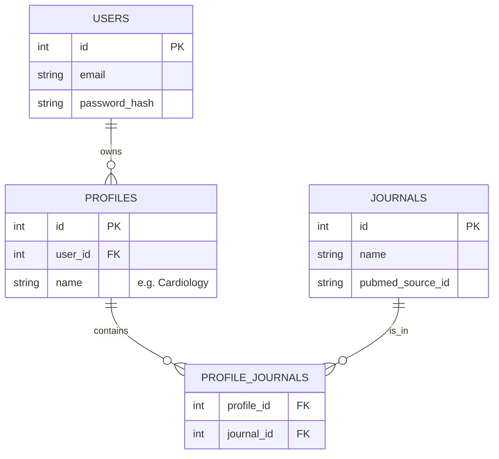

# Technical Design Artifact: MedBrief Implementation Plan
This document serves as the Technical Design Artifact required by Phase 1 of `AGENT.md`.

# Goal Description
Build "MedBrief", a web application that provides weekly signals from medical research. The app allows users to sign in, manage journal subscriptions, and generate weekly briefs from PubMed.

## User Review Required
> [!IMPORTANT]
> **Clarification Questions (Please Answer)**:
> 1.  **Auth Strategy**: Is a simple local JWT/password auth sufficient for v1, or is OAuth (Google/GitHub) required immediately?
> 2.  **Deployment**: Shall we target a local Docker Compose setup as the primary deliverable, or do you need Terraform/Cloud Run configuration files now?
> 3.  **Journal List**: Do you have a specific list of journals (ISSNs) to seed the database with, or should I start with a sample set (e.g., NEJM, Lancet)?
> 4.  **Brief Content**: Should the "Brief" use a generative AI (LLM) to summarize the content, or is it strictly a display of the PubMed abstract/metadata? (The prompt implies "signals" and "brief", which could mean AI summary).
> 5.  **Data Persistence**: Is SQLite acceptable for the development/v0 phase to simplify portability, with Postgres config provided for production?

> [!NOTE]
> **Tech Stack Proposal**:
> *   **Backend**: **FastAPI** (Python 3.10+).
>     *   *Why*: Modern, high-performance, automatic API docs (Swagger UI), and excellent async support for external calls to PubMed.
>     *   *DB ORM*: **SQLAlchemy** (Async) + **Alembic** (Migrations).
>     *   *DB*: **SQLite** (Local development) -> **PostgreSQL** (Production/Cloud Run).
> *   **Frontend**: **Vue.js 3** (via Vite).
>     *   *Why*: User familiarity, fast reactive UI.
>     *   *Styling*: **Bootstrap 5** (as per Plan).
> *   **Deployment**: **Docker Compose** (Local), **Cloud Run** (Production ready).

## Proposed Changes

### Project Structure
```text
/
  backend/       # FastAPI application
    app/
      models/    # SQLAlchemy models
      routers/   # API endpoints
      services/  # PubMed fetcher, Auth logic
    alembic/     # DB Migrations
    main.py      # App entrypoint
  frontend/      # Vue 3 Vite application
    src/
      components/
      views/
  Dockerfile     # Multi-stage build (Node build -> Python run)
  docker-compose.yml # For easy local dev (Db + API + Frontend)
```

### Components

#### 1. App Workflow (User Flow)
```mermaid
graph TD
    A[Landing Page] -->|Sign Up/Login| B[Dashboard]
    B -->|First Time?| C[Onboarding: Create Default Profile]
    C --> D[Search & Add Journals]
    D --> E[Save Profile]
    E --> B
    B -->|Select Profile| F[Fetch Brief (Last 7 Days)]
    F --> G[View Brief List]
    G -->|Action| H[Copy to Clipboard / Export]
    B -->|Manage| I[Settings: Create/Edit Profiles]
    I --> B
```

#### 1.1. Onboarding Wizard (New User Flow)
*   **Step 1: Welcome & Setup**: "Welcome to MedBrief. Let's set up your first research feed."
*   **Step 2: Journal Selection**:
    1.  User searches for journals (e.g., "Cardiology").
    2.  System queries local DB (or PubMed ID if cached) to find journals.
    3.  User checks boxes to "Follow" journals.
*   **Step 3: Profile naming**: "Name this feed (e.g., 'My Cardiology Update')".
*   **Step 4: Completion**: "All set! Fetching your first brief..." -> Redirects to Dashboard.

#### 2. Database Schema (SQLAlchemy/Postgres)


#### 3. Backend (FastAPI)
*   **Auth**: JWT-based authentication.
*   **Database Models**:
    *   `User`: id, email, password_hash.
    *   `Profile`: id, user_id, name (default="My Brief").
    *   `ProfileJournal`: Association table (profile_id, journal_id).
    *   `Journal`: id, pubmed_id, name, iso_abbreviation.
*   **API Routes**:
    *   `POST /auth/register`
    *   `GET /api/journals/search?q=...`
    *   `POST /api/profiles` (Create/Update profiles)
    *   `GET /api/brief/generate?profile_id=...&days=7` (Fetch PubMed abstracts)

#### 3. Backend Strategy: PubMed Integration
*   **Search Logic (Entrez API)**:
    1.  **Construct Query**: Combine Journal ISSNs/Names with Date Range.
        *   `("Journal A"[Journal] OR "0028-4793"[ISSN]) AND ("2025/12/19"[PDAT] : "2025/12/26"[PDAT])`
    2.  **Step 1 (ESearch)**: Get list of PMIDs (WebEnv/QueryKey history).
    3.  **Step 2 (EFetch)**: Retrieve full XML records for those PMIDs.
    4.  **Rate Limiting**: Enforce <3 requests/sec (Public API limit).

#### 4. Frontend (Vue 3 + Bootstrap)
*   **Views**:
    *   `Login.vue` / `Register.vue`
    *   `Onboarding.vue` (Journal selection)
    *   `Dashboard.vue`:
        *   **Controls**: Profile Switcher, Date Range Picker (Default: Last 7 days).
        *   **Layout**: Toggle between **Card View** and **List View**.
        *   **Item View**: Expandable to show full Abstract + Links (PubMed).
        *   **Actions**:
            *   Select One/Multiple/All items.
            *   **Export**: Generate .ris, .nbib, .txt files for selected items.
*   **State**: Pinia (lightweight state management for User session).

#### 3. Deployment
*   **Environment Config**: `pydantic-settings` to switch between `sqlite:///./app.db` and `postgres://...` URLs.

## Verification Plan

### Automated Tests
*   **Backend**: `pytest` for API endpoints (creating users, fetching journals).
*   **Frontend**: Check build success.

### Manual Verification
1.  **Local Run**: `docker-compose up`.
2.  **Auth Flow**: Register -> Login -> Get Token.
3.  **PubMed Proxy**: Search for a journal via the UI and verify results match PubMed.
4.  **Brief Generation**: Select journals -> Generate -> Verify JSON/UI output.
